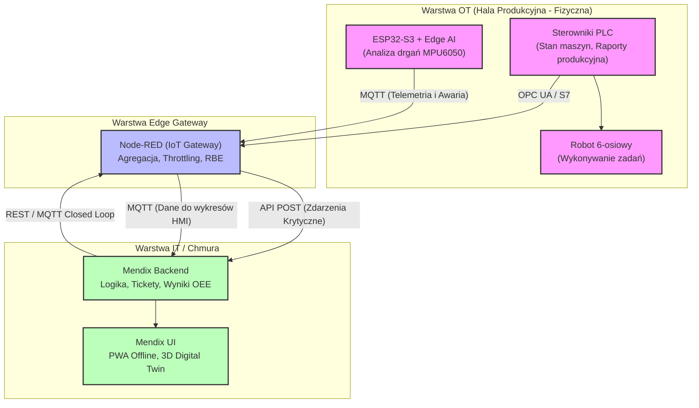

# Smart Factory 5.0 - Portfolio Project

[PL] Witaj w repozytorium projektu **Smart Factory 5.0**. Jest to kompleksowa aplikacja klasy Enterprise, demonstrująca integrację systemów automatyki przemysłowej (OT) z chmurą i rozwiązaniami Edge AI za pomocą Node-RED i Mendixa.

[EN] Welcome to the **Smart Factory 5.0** repository. This is a comprehensive enterprise-grade project demonstrating the integration of Industrial Automation (OT) systems with Cloud and Edge AI solutions using Node-RED and Mendix.

---

## 🏗️ Repository Structure / Struktura Repozytorium

Detailed architecture plan / Szczegółowy plan architektury: [**Smart_Factory_5.0_Plan.md**](./Smart_Factory_5.0_Plan.md).

The following directories contain specific parts of the environment, code, and backups:
Poniższe katalogi zawierają poszczególne części środowiska, kod oraz kopie zapasowe (backupy):

*   **[ESP/](./ESP)** - Kod mikrokontrolera ESP32-S3 (PlatformIO) dla roli Edge AI i odczytu drgań z MPU6050. Zawiera również archiwum kodu (`backup/`).
*   **[Node-red/](./Node-red)** - Przepływy (flows) brzegowej bramki IoT Node-RED (agregacja, MQTT, OPC-UA, routing do Mendixa). Zawiera plik `flows.json`.
*   **[PLC/](./PLC)** - Logika automatyki przemysłowej, w tym kod dla S7-1500 (TIA Portal v19) oraz pliki zrzutów (`backup/`).
*   **[Mendix/](./Mendix)** - Pliki projektu webowego eksportowane z Mendix Studio Pro (MES/WMS, logika biznesowa, dashboardy).
*   **[MendixMobileApp/](./MendixMobileApp)** - Pliki projektu mobilnej aplikacji PWA Mendix przeznaczonej do zgłaszania usterek offline.

---

## 🎥 Demonstration Video / Wideo Demonstracyjne

Watch the full system in action here / Zobacz pełne działanie systemu:
> [**Smart Factory 5.0 - Full Demo**](https://youtu.be/SBSa59YZOQo)

---

## ⚙️ Architektura Systemu i Diagram Działania

Oto wysokopoziomowy diagram przepływu danych pomiędzy poszczególnymi warstwami architektury zgodnej z założeniami Przemysłu 4.0/5.0:

